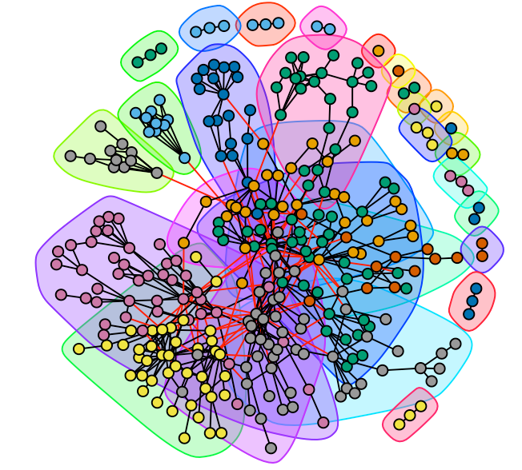
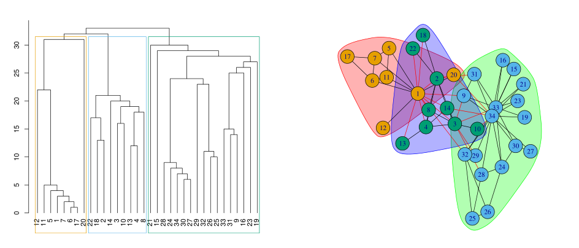
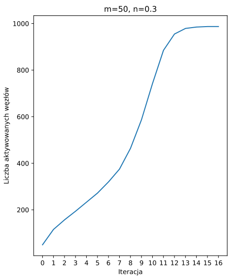
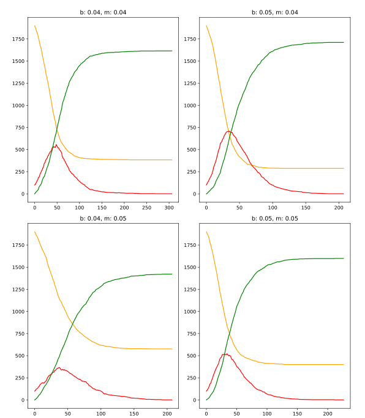

<h1 align="center">Complex Networks</h1>

## Lab 2

Introduction to iGraph in R.

- loading and saving graphs
- visualisation
- synthethic graphs (ER, BA, WS)
- nodes degree

## Lab 3

Network metrics.

- shortest path
- network diameter
- closeness
- betweenness

## Lab 4

Communities.

- community detection (V. Blondel algorithm)
- modularity metric
- communities visualisation
- dendrograms
- karate club network

## Lab 5

Temporal networks.

- networkDynamic
- Streaming Classroom Interactions Dataset
- edges dynamics
- centrality dynamics
- fwd and bkwd paths
- animations

## Lab 6

Multilayer networks.

- multinet
- metrics for multilayer networks
- communities detection
- distance metrics
- loading/saving to file
- evolving network
- layers comparison
- visualisation

## Lab 7

Social influence

- Linear Threshold model

## Lab 8

SIR Model

## Lab 9

SIR model with adaptive availability. Added parameter of availability of edges.

## Lab 10

Concurrent processes on SIR model.

## Lab 11

SIR model with pernament deletion of nodes.

## Sources

* https://igraph.org/python/doc/tutorial/tutorial.html
* http://snap.stanford.edu/data/ego-Facebook.html 
